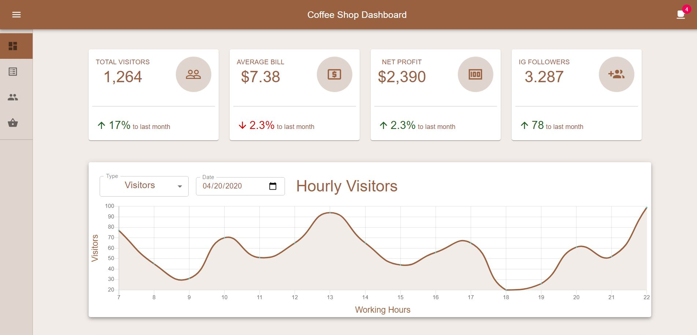
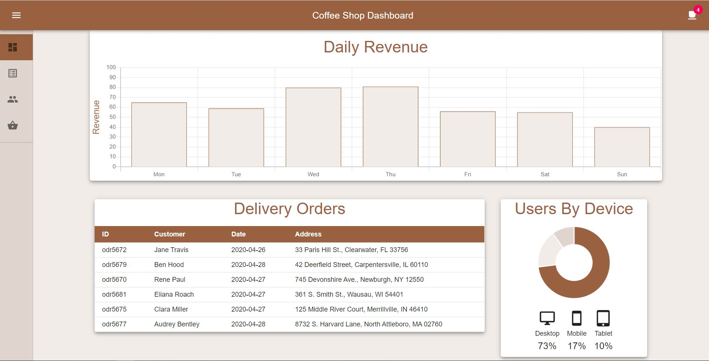
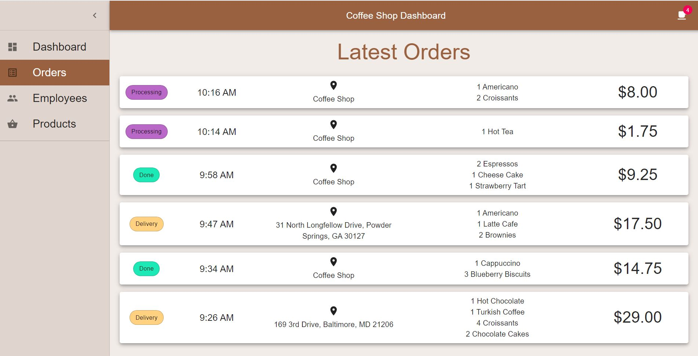
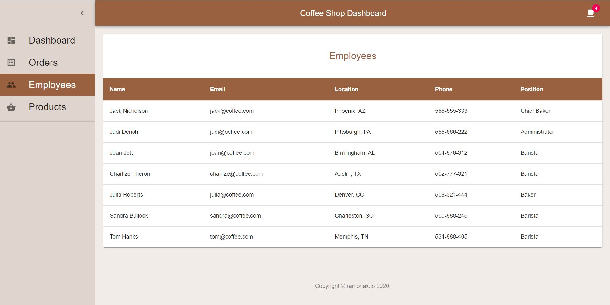
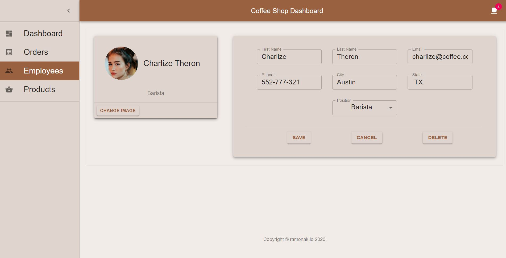
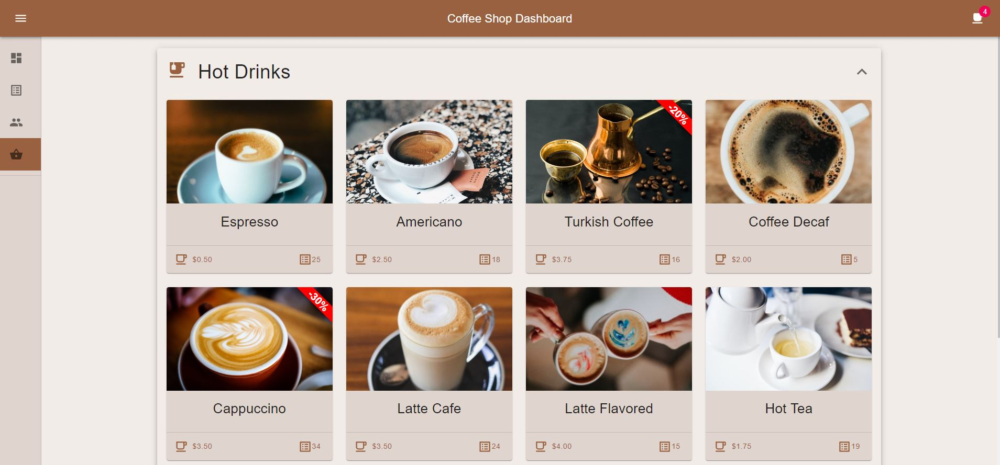

# Coffee Shop Dashboard

A sample dashboard for a Coffee Shop. An owner or administrator can have in one place all information about orders, products, sales, employees, and many more.

<p float="left">
    
   
   
   
   
   
</p>

## Technologies used

- [React.js](https://reactjs.org/)
- [Material-UI](https://material-ui.com/)
- [React Charts](https://github.com/jerairrest/react-chartjs-2)

## Run the app

1. Clone this repo
2. ```cd coffee-shop-dashboard```
3. ```npm install```
4. ```npm start```

This project was bootstrapped with [Create React App](https://github.com/facebook/create-react-app).